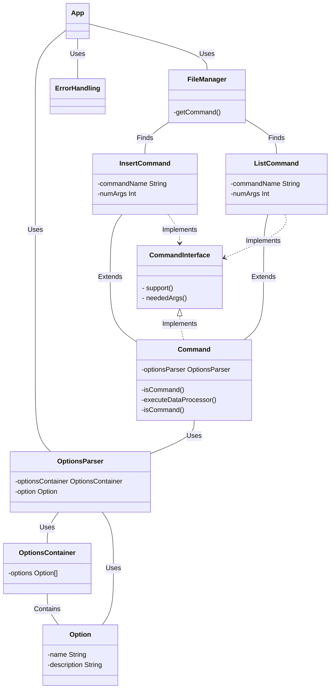

# L3 design pattern report

- **Firstname**: Sacha
- **Lastname**: Duvivier

> Add your thoughts on every TP bellow, everything is interresting but no need to right a book.
>
> Keep it short simple and efficient:
>
> - What you did and why
> - What helped you and why
> - What did you find difficult
> - What did not help you
> - What did you need to change
> - Anything relevant
>
> Add a link to schemas describing your architecture (UML or not but add a legend)
>
> Remember: it is ok to make mistakes, you will have time to spot them later.
>
> Fill free to contact me if needed.

---
...

I added few improvements:
- a generic class to create commands, now if you want to add new commands, you'il need to specify what it does when it runs how many of arguments needed to use the command and the name of it
- i added in the same way to create an Option, you can add option by adding a class it in the OptionsContainer so its way easier to add options (i could i added a way to register options inside a command but not enough time)
- a class to handle the options
- a class to handle the errors to have the same format at each times

The code is better this way because its way simplier to add features in the long run,
a code inside a single function is not ideal, it works but not efficient and when you need to modify it its hard.

Here is a slight simple UML to understand what i did: (using mermaid)

## 4/2/2024:
- I added done option to the insert command / list command by adding a new option to the OptionsContainer
- and added Done information to Json file and Csv file so i can determine if the task is done or not

## 10/2/2024:
- now no need to add the name of the command in the app class,
- so if you want to add a new command you just need to add a new class that extends Command and implement the Csv & Json class to process
- i added a new class to handle the file processing, so now the app class is way more cleaner.
