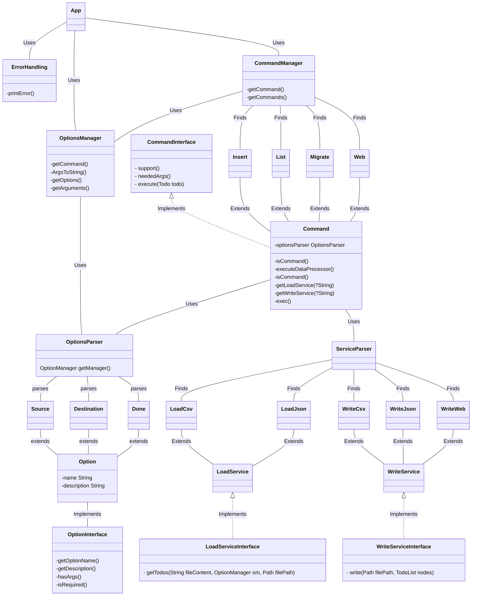

# L3 design pattern report

- **Firstname**: Sacha
- **Lastname**: Duvivier


> Add your thoughts on every TP bellow, everything is interresting but no need to right a book.
>
> Keep it short simple and efficient:
>
> - What you did and why
> - What helped you and why
> - What did you find difficult
> - What did not help you
> - What did you need to change
> - Anything relevant
>
> Add a link to schemas describing your architecture (UML or not but add a legend)
>
> Remember: it is ok to make mistakes, you will have time to spot them later.
>
> Fill free to contact me if needed.

---
...

I added few improvements:
- a generic class to create commands, now if you want to add new commands, you'il need to specify what it does when it runs how many of arguments needed to use the command and the name of it
- i added in the same way to create an Option, you can add option by adding a class it in the OptionsContainer so its way easier to add options (i could i added a way to register options inside a command but not enough time)
- a class to handle the options
- a class to handle the errors to have the same format at each times

The code is better this way because its way simplier to add features in the long run,
a code inside a single function is not ideal, it works but not efficient and when you need to modify it its hard.


Here is a slight simple UML to understand what i did: (using mermaid)


## 4/2/2024:
- I added done option to the insert command / list command by adding a new option to the OptionsContainer
- and added Done information to Json file and Csv file so i can determine if the task is done or not


## 10/2/2024:
- now no need to add the name of the command in the app class,
- so if you want to add a new command you just need to add a new class that extends Command and implement the Csv & Json class to process
- i added a new class to handle the file processing, so now the app class is way more cleaner.

## 22-23/2/2024:
- i completely changed the way the app works, now each command is registered in a yaml file, so you can add new commands by adding them in the yaml file, the same for the options and to add a new extension there are a yaml file for that too.
- i tried to change the way the commands are processed, now the app class is way more cleaner and the code is way more readable.
- each class has a unique usage so its better to understand what the class does.

## Mini Documentation

### Adding new command
Adding a new **command** is easy, you just need to add a new class that ``extends Command``
and add it to the ``commands.yaml`` file with the class path and its name
you just need 3 functions to implement: ``support, neededArgs, and execute`` that are really easy to implement
you can override the loading service and the writing service to add your own way to load and write data
```yaml
commands:
  - name: MyExampleCommand
    class: com.myexample.MyExampleCommand
```

### Adding new option
Adding a new option is easy, you just need to add a new class that ``extends Option`` : 
define a constructor that is empty and that calls the super constructor with the name,longname of the option.
and you'il need to implements the 4 functions ``optionName, description, args and required`` and finaly add it to the ``options.yaml`` file with the class path and its name

```yaml
options:
  - name: MyExampleOption
    class: com.myexample.MyExampleOption
```

### Adding new Extension / Loading Service / Writing Service
Adding a new Service/Extension is easy too, you just need to add a new class that 
``extends WriteService`` or ``extends LoadService`` depending on what you want to do

if you want to add a new way to load data you just need to add it to the ``services.yaml`` file
like this:
```yaml
load-services:
  - extension: txt
    class: com.myexample.TxtLoadService
```
and implement ``getTodos`` function
if you want to add a new way to write data you just need to add it to the ``services.yaml`` file
like this:
```yaml
write-services:
  - extension: txt
    class: com.myexample.TxtWriteService
```